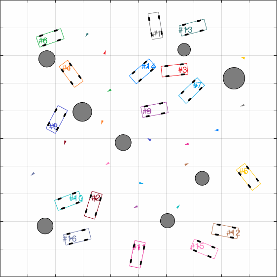

# MVTP Benchmark

Benchmark suite and solver for Multiple Vehicle Trajectory Planning (MVTP) problems.

Supported Platforms:

* Windows x64
* macOS x64

## Papers

Users must cite the following articles if they use the source codes to conduct simulations in their new publications.

* Yakun Ouyang, Bai Li, Youmin Zhang, et al., "Fast and Optimal Trajectory Planning for Multiple Vehicles in a Nonconvex and Cluttered Environment: Benchmarks, Methodology, and Experiments," accepted by *2022 IEEE International Conference on Robotics and Automation (ICRA)* on Jan. 31, 2022.
* Bai Li, Yakun Ouyang, Youmin Zhang, et al, "Optimal Cooperative Maneuver Planning for Multiple Nonholonomic Robots in a Tiny Environment via Adaptive-Scaling Constrained Optimization," in *IEEE Robotics and Automation Letters*, vol. 6, no. 2, pp. 1511-1518, April 2021, doi: 10.1109/LRA.2021.3056346.

## How to run

1. Download CasADi/MATLAB package from [CasADi](https://web.casadi.org/get/), extract binaries to `casadi` folder
   1. **[Optional]** For best performance, users are encouraged to request **ma27** linear solver code from [HSL for IPOPT](https://www.hsl.rl.ac.uk/ipopt/)
   2. follow the install instructions from [Obtaining HSL](https://github.com/casadi/casadi/wiki/Obtaining-HSL)
   3. set `linear_solver` to `ma27` in [`params/GetModelParams.m`](https://github.com/libai1943/MVTP_benchmark/blob/main/params/GetModelParams.m#L16)
2. Run `RunBenchmark.m`
3. Play with different benchmark cases and different parameters

---

Copyright (C) 2022 Yakun Ouyang and Bai Li
